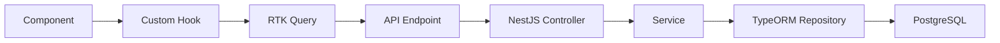

Lens Music is built as a modern full-stack application with a TypeScript monorepo structure, combining a NestJS backend API with a React-based frontend client.

## Monorepo structure

The codebase is organized as a monorepo with two main packages:

```
lens-music/
├── api/              # NestJS backend application
│   ├── src/
│   ├── package.json
│   └── tsconfig.json
├── client/           # React frontend application
│   ├── src/
│   ├── package.json
│   └── tsconfig.json
├── dev.sh           # Development startup script
└── README.md
```

<Note>
The `dev.sh` script installs dependencies and starts both the API and client in development mode simultaneously.
</Note>

## Backend architecture (NestJS)

The API is built with NestJS, a progressive Node.js framework that uses TypeScript and follows architectural patterns similar to Angular.

### Core technologies

- **Framework:** NestJS 10.4
- **Database:** PostgreSQL with TypeORM
- **Authentication:** JWT with bcrypt password hashing
- **Validation:** class-validator and class-transformer
- **Logging:** Pino logger

### Directory structure

```
api/src/
├── common/                    # Shared utilities
│   ├── decorators/           # Custom decorators (@CurrentUser, @Roles)
│   ├── filters/              # Exception filters
│   └── guards/               # Auth guards (JWT, Roles)
├── constants/                # Application constants
│   ├── artist.constants.ts
│   ├── auth.constant.ts
│   ├── location.constant.ts
│   ├── permission.constants.ts
│   └── user.constants.ts
├── entities/                 # TypeORM database entities
│   ├── abstract.entity.ts
│   ├── artist.entity.ts
│   ├── label.entity.ts
│   ├── lyrics.entity.ts
│   ├── permission.entity.ts
│   ├── release.entity.ts
│   ├── releaseArtist.entity.ts
│   ├── role.entity.ts
│   ├── rolePermission.entity.ts
│   ├── track.entity.ts
│   └── user.entity.ts
├── helpers/                  # Helper functions
│   ├── encryptions.helper.ts
│   ├── errors.helper.ts
│   ├── pagination.helper.ts
│   ├── strings.helper.ts
│   └── validations.helper.ts
├── modules/                  # Feature modules
│   ├── artists/
│   ├── auth/
│   ├── labels/
│   ├── lyrics/
│   ├── releases/
│   ├── roles/
│   └── users/
├── seeds/                    # Database seeders
├── types/                    # TypeScript type definitions
├── utils/                    # Utility functions
├── app.module.ts            # Root application module
├── data-source.ts           # TypeORM data source config
└── main.ts                  # Application entry point
```

### Module architecture

Each feature module follows the NestJS pattern:

```typescript
modules/[feature]/
├── dto/                     # Data Transfer Objects
│   ├── create-[feature].dto.ts
│   └── update-[feature].dto.ts
├── [feature].controller.ts  # HTTP request handlers
├── [feature].service.ts     # Business logic
└── [feature].module.ts      # Module definition
```

<Accordion title="Example: Releases module structure">
```typescript
// releases.controller.ts
@Controller('releases')
@UseGuards(JwtAuthGuard)
export class ReleasesController {
  constructor(private readonly releaseService: ReleaseService) {}

  @Post()
  async createRelease(@Body() dto: CreateReleaseDto, @CurrentUser() user: AuthUser) {
    // Controller logic
  }

  @Get()
  async fetchReleases(@Query('size') size = '10', @Query('page') page = '0') {
    // Fetch with pagination
  }
}
```
</Accordion>

### Database layer

The application uses TypeORM with PostgreSQL. All entities extend from a base `AbstractEntity`:

```typescript
// abstract.entity.ts
export abstract class AbstractEntity {
  id: UUID;
  createdAt: Date;
  updatedAt: Date;
}
```

### Entity relationships

The database schema includes the following main entities and relationships:

<Steps>
  <Step title="User entity">
    Central entity managing authentication and ownership:
    - Has many Labels
    - Has many Artists
    - Has many Releases
    - Has many Roles (as creator)
  </Step>

  <Step title="Label entity">
    Represents music labels:
    - Belongs to User
    - Has many Releases
    - Contains: name, email, description, country
  </Step>

  <Step title="Artist entity">
    Artist profiles:
    - Belongs to User
    - Has many ReleaseArtist (many-to-many with Releases)
    - Has status: ACTIVE/INACTIVE
  </Step>

  <Step title="Release entity">
    Music releases (albums, singles, EPs):
    - Belongs to User and Label
    - Has many Tracks
    - Has many ReleaseArtist (artists on the release)
    - Contains: title, UPC, release date, catalog number, production year
    - Unique constraint: [title, releaseDate, productionYear, userId, labelId, version]
  </Step>

  <Step title="Track entity">
    Individual songs:
    - Belongs to Release
    - Has many Lyrics
    - Contains: title, duration, ISRC, explicit flag
  </Step>
</Steps>

<Warning>
The application uses `synchronize: true` in TypeORM configuration, which automatically syncs the schema. This should be disabled in production.
</Warning>

### Application bootstrap

The API starts on port 8080 (configurable via `PORT` environment variable):

```typescript:api/src/main.ts
const app = await NestFactory.create(AppModule);

app.setGlobalPrefix('api');  // All routes prefixed with /api
app.enableCors();            // CORS enabled
app.useGlobalPipes(new ValidationPipe({
  whitelist: true,
  transform: true,
}));

await app.listen(port);
```

## Frontend architecture (React)

The client is a modern React application built with Vite and TypeScript.

### Core technologies

- **Framework:** React 18.2
- **Build tool:** Vite 5.2
- **State management:** Redux Toolkit with RTK Query
- **Routing:** React Router v6
- **UI components:** Radix UI primitives
- **Styling:** Tailwind CSS 4.1 with custom animations
- **Forms:** React Hook Form
- **Icons:** Font Awesome, Lucide React
- **3D graphics:** Three.js with React Three Fiber

### Directory structure

```
client/src/
├── components/               # Reusable UI components
│   ├── feedbacks/           # Toast, alerts, etc.
│   ├── graphs/              # Data visualization
│   ├── inputs/              # Form inputs
│   ├── landing/             # Landing page components
│   ├── layout/              # Layout components
│   ├── modals/              # Modal dialogs
│   ├── table/               # Data tables
│   ├── text/                # Typography components
│   └── ui/                  # Radix UI components
├── constants/               # Application constants
├── containers/              # Container components
├── hooks/                   # Custom React hooks
│   ├── common/
│   ├── labels/
│   ├── lyrics/
│   └── releases/
├── lib/                     # Utility libraries
├── outlets/                 # Route outlets
├── pages/                   # Page components
│   ├── artists/
│   ├── authentication/      # Login, Signup
│   ├── common/
│   ├── dashboard/
│   ├── labels/
│   ├── lyrics/
│   ├── releases/
│   └── roles/
├── state/                   # Redux state management
│   ├── api/                # RTK Query API slices
│   ├── features/           # Feature slices
│   ├── hooks.ts            # Typed Redux hooks
│   └── store.ts            # Store configuration
├── types/                   # TypeScript types
├── utils/                   # Utility functions
├── App.tsx                 # Root component
├── Router.tsx              # Route definitions
└── main.tsx                # Application entry point
```

### State management

The application uses Redux Toolkit with separate slices for different features:

```typescript:client/src/state/store.ts
export const store = configureStore({
  reducer: {
    [apiMutationSlice.reducerPath]: apiMutationSlice.reducer,
    [apiQuerySlice.reducerPath]: apiQuerySlice.reducer,
    auth: authSlice,
    user: userSlice,
    artist: artistSlice,
    label: labelSlice,
    release: releaseSlice,
    lyric: lyricSlice,
    sidebar: sidebarSlice,
  },
});
```

<Note>
RTK Query is used for API communication, providing automatic caching, request deduplication, and optimistic updates.
</Note>

### Routing structure

The application uses React Router with protected routes:

```typescript
/                           # Landing page
/auth/login                # Authentication
/auth/signup

# Protected routes (require authentication)
/dashboard                 # User dashboard
/artists                   # Artist management
/labels                    # Label management
/releases                  # Release management
/lyrics                    # Lyrics management
  /lyrics/create
  /lyrics/sync
/roles                     # Role management
```

Authenticated routes are wrapped in an `AuthenticatedRoutes` outlet that handles authentication checks.

### Component organization

<Accordion title="Component categories">
**UI Components** (`components/ui/`)
- Radix UI primitives (dialogs, popovers, selects)
- Styled with Tailwind CSS and class-variance-authority

**Input Components** (`components/inputs/`)
- Form fields integrated with React Hook Form
- Validation with real-time feedback

**Layout Components** (`components/layout/`)
- Headers, sidebars, navigation
- Responsive design patterns

**Page Components** (`pages/`)
- Full page views
- Data fetching with custom hooks
- Integration with Redux state
</Accordion>

## API communication

The frontend communicates with the backend through:

1. **Base URL:** Configured API endpoint (default: `http://localhost:8080/api`)
2. **Authentication:** JWT tokens stored in Redux and sent via Authorization headers
3. **Request handling:** RTK Query for automatic caching and state synchronization

### Request flow



## Development workflow

### Starting the application

```bash
# Clone the repository
git clone https://github.com/lens-ltd/lens-music
cd lens-music

# Make dev script executable
chmod +x dev.sh

# Start both API and client
./dev.sh
```

### Environment configuration

The API requires environment variables:

```bash
# Database
DB_HOST=localhost
DB_PORT=5432
DB_USER=postgres
DB_PASSWORD=your_password
DB_NAME=lens_music

# Authentication
JWT_SECRET=your_jwt_secret

# Server
PORT=8080
```

<Warning>
Never commit `.env` files to version control. Use `.env.example` for documentation.
</Warning>

## Security features

<AccordionGroup>
  <Accordion title="Authentication">
    - JWT tokens with 1-week expiration
    - Bcrypt password hashing
    - Custom `@CurrentUser()` decorator for accessing authenticated user
  </Accordion>

  <Accordion title="Authorization">
    - Role-based access control (RBAC)
    - Custom `@Roles()` decorator
    - RolesGuard for route protection
  </Accordion>

  <Accordion title="Validation">
    - Global ValidationPipe with whitelist
    - DTO validation with class-validator
    - Email validation helper
  </Accordion>

  <Accordion title="Error handling">
    - Global HttpExceptionFilter
    - Structured error responses
    - Logging with Pino
  </Accordion>
</AccordionGroup>

## Deployment considerations

<Steps>
  <Step title="Database migrations">
    Disable `synchronize: true` and implement proper migrations for production.
  </Step>

  <Step title="Environment variables">
    Set all required environment variables in production environment.
  </Step>

  <Step title="SSL/TLS">
    Enable SSL for database connections in production (automatically disabled for localhost).
  </Step>

  <Step title="CORS configuration">
    Configure CORS to only allow specific origins in production.
  </Step>

  <Step title="Build optimization">
    Build both API and client for production:
    ```bash
    # API
    cd api && npm run build
    
    # Client
    cd client && npm run build
    ```
  </Step>
</Steps>

## Next steps

<CardGroup cols={2}>
  <Card title="Quickstart Guide" icon="rocket" href="/quickstart">
    Start building with Lens Music
  </Card>
  <Card title="API Reference" icon="book" href="/api/overview">
    Explore all API endpoints
  </Card>
  <Card title="Database Schema" icon="database" href="/development/database-schema">
    Deep dive into the data model
  </Card>
  <Card title="Development Setup" icon="code" href="/development/setup">
    Set up your development environment
  </Card>
</CardGroup>
