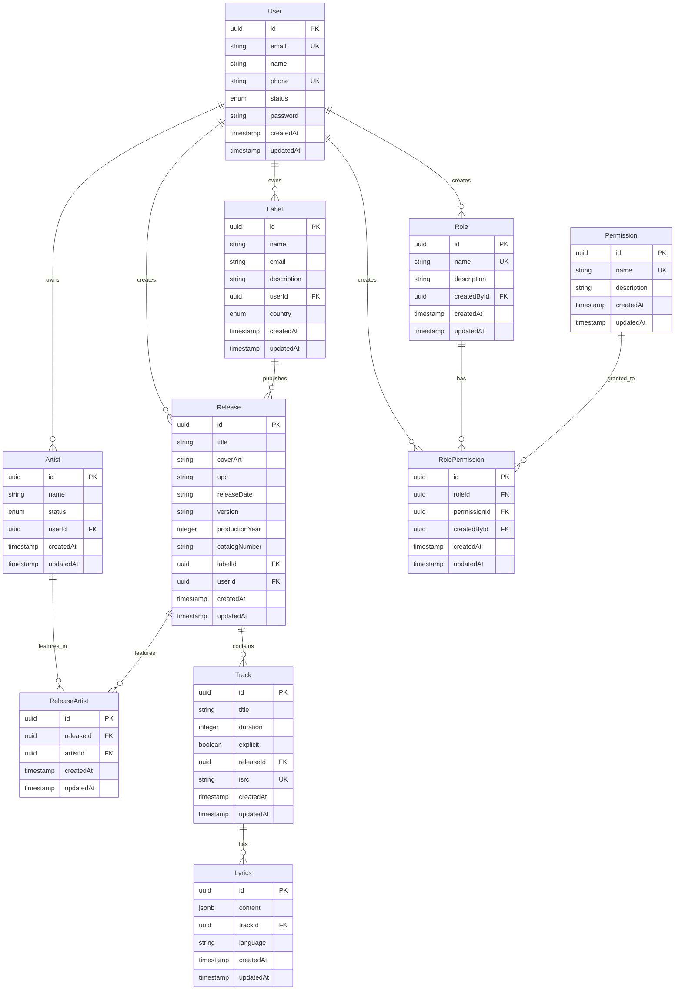

Lens Music uses PostgreSQL with TypeORM to manage a relational database schema. This page documents all entities, their fields, and relationships in the database.

## Entity overview

The database consists of the following core entities:

<CardGroup cols={3}>
  <Card title="User" icon="user">
    User accounts and authentication
  </Card>
  <Card title="Artist" icon="microphone">
    Artist profiles and metadata
  </Card>
  <Card title="Label" icon="record-vinyl">
    Record label information
  </Card>
  <Card title="Release" icon="compact-disc">
    Albums, singles, and EPs
  </Card>
  <Card title="Track" icon="music">
    Individual songs
  </Card>
  <Card title="Lyrics" icon="file-lines">
    Song lyrics with timestamps
  </Card>
  <Card title="Role" icon="user-tag">
    User roles
  </Card>
  <Card title="Permission" icon="shield-check">
    System permissions
  </Card>
  <Card title="RolePermission" icon="link">
    Role-permission mappings
  </Card>
</CardGroup>

## Base entity

All entities extend the `AbstractEntity` class, which provides common fields:

### AbstractEntity

<ResponseField name="id" type="UUID" required>
  Unique identifier for the entity. Auto-generated using PostgreSQL's UUID generation.
</ResponseField>

<ResponseField name="createdAt" type="timestamp" required>
  Timestamp when the entity was created. Automatically set to `CURRENT_TIMESTAMP` on creation.
</ResponseField>

<ResponseField name="updatedAt" type="timestamp" required>
  Timestamp when the entity was last updated. Automatically updated to `CURRENT_TIMESTAMP` on any modification.
</ResponseField>

```typescript
id: UUID
createdAt: Date
updatedAt: Date
```

<Note>
  All entities inherit these fields automatically. They don't need to be explicitly defined in child entities.
</Note>

## Core entities

### User

Represents user accounts in the system. Users can create labels, artists, and releases.

**Table name:** `user`

<ParamField path="email" type="string" required>
  User's email address. Must be unique and valid.
  
  - **Max length:** 255 characters
  - **Validation:** Email format validation
  - **Unique constraint:** Yes
</ParamField>

<ParamField path="name" type="string" required>
  User's full name.
  
  - **Max length:** 255 characters
</ParamField>

<ParamField path="phone" type="string">
  User's phone number (optional).
  
  - **Max length:** 255 characters
  - **Unique constraint:** Yes (composite with email)
</ParamField>

<ParamField path="status" type="enum" required>
  Account status.
  
  - **Values:** `ACTIVE`, `INACTIVE`, `SUSPENDED`
  - **Default:** `ACTIVE`
</ParamField>

<ParamField path="password" type="string" required>
  Hashed password. Not included in query results by default.
  
  - **Max length:** 255 characters
  - **Select:** `false` (excluded from queries)
</ParamField>

**Relationships:**
- Has many `labels` (one-to-many with Label)
- Has many `artists` (one-to-many with Artist)
- Has many `releases` (one-to-many with Release)
- Has many `createdRoles` (one-to-many with Role)
- Has many `createdRolePermissions` (one-to-many with RolePermission)

**Source:** `api/src/entities/user.entity.ts:14`

---

### Artist

Represents artists who create music. Artists belong to users and can be associated with multiple releases.

**Table name:** `artists`

<ParamField path="name" type="string" required>
  Artist's name or stage name.
</ParamField>

<ParamField path="status" type="enum" required>
  Artist's status in the system.
  
  - **Values:** `ACTIVE`, `INACTIVE`
  - **Default:** `ACTIVE`
</ParamField>

<ParamField path="userId" type="UUID" required>
  Foreign key to the user who owns this artist profile.
</ParamField>

**Relationships:**
- Belongs to `user` (many-to-one with User)
  - `onDelete: CASCADE` - Artist is deleted when user is deleted
  - `onUpdate: CASCADE` - Artist's userId updates when user id changes
- Has many `releases` through `ReleaseArtist` (one-to-many)

**Source:** `api/src/entities/artist.entity.ts:13`

---

### Label

Represents record labels that publish music releases.

**Table name:** `labels`

<ParamField path="name" type="string" required>
  Label's name.
  
  - **Max length:** 255 characters
</ParamField>

<ParamField path="email" type="string">
  Label's contact email address (optional).
  
  - **Max length:** 255 characters
</ParamField>

<ParamField path="description" type="string">
  Description of the label (optional).
  
  - **Max length:** 255 characters
</ParamField>

<ParamField path="userId" type="UUID" required>
  Foreign key to the user who owns this label.
</ParamField>

<ParamField path="country" type="enum" required>
  Country where the label is based.
  
  - **Values:** ISO country codes (e.g., `RW`, `US`, `GB`)
  - **Default:** `RW` (Rwanda)
</ParamField>

**Relationships:**
- Belongs to `user` (many-to-one with User)
- Has many `releases` (one-to-many with Release)

**Source:** `api/src/entities/label.entity.ts:15`

---

### Release

Represents music releases (albums, singles, EPs) distributed through the platform.

**Table name:** `releases`

<ParamField path="title" type="string" required>
  Release title.
</ParamField>

<ParamField path="coverArt" type="string">
  URL or path to the release cover art image (optional).
</ParamField>

<ParamField path="upc" type="string">
  Universal Product Code for the release (optional).
</ParamField>

<ParamField path="releaseDate" type="string" required>
  Date when the release is published.
</ParamField>

<ParamField path="version" type="string">
  Release version (e.g., "Deluxe Edition", "Remastered") - optional.
</ParamField>

<ParamField path="productionYear" type="integer" required>
  Year the release was produced.
</ParamField>

<ParamField path="catalogNumber" type="string">
  Label's catalog number for the release (optional).
</ParamField>

<ParamField path="labelId" type="UUID">
  Foreign key to the associated label (optional).
</ParamField>

<ParamField path="userId" type="UUID" required>
  Foreign key to the user who created this release.
</ParamField>

**Unique constraint:** Combination of `title`, `releaseDate`, `productionYear`, `userId`, `labelId`, and `version` must be unique.

**Relationships:**
- Belongs to `label` (many-to-one with Label)
  - `onDelete: CASCADE` - Release is deleted when label is deleted
  - `onUpdate: CASCADE`
- Belongs to `user` (many-to-one with User)
  - `onDelete: CASCADE` - Release is deleted when user is deleted
  - `onUpdate: CASCADE`
- Has many `artists` through `ReleaseArtist` (one-to-many)
- Has many `tracks` (one-to-many with Track)

**Source:** `api/src/entities/release.entity.ts:15`

---

### Track

Represents individual tracks (songs) within a release.

**Table name:** `tracks`

<ParamField path="title" type="string" required>
  Track title.
</ParamField>

<ParamField path="duration" type="integer" required>
  Track duration in seconds.
</ParamField>

<ParamField path="explicit" type="boolean" required>
  Whether the track contains explicit content.
  
  - **Default:** `false`
</ParamField>

<ParamField path="releaseId" type="UUID" required>
  Foreign key to the release this track belongs to.
</ParamField>

<ParamField path="isrc" type="string">
  International Standard Recording Code - unique identifier for the recording (optional).
  
  - **Unique constraint:** Yes
</ParamField>

**Relationships:**
- Belongs to `release` (many-to-one with Release)
- Has many `lyrics` (one-to-many with Lyrics)

**Source:** `api/src/entities/track.entity.ts:7`

---

### Lyrics

Stores synchronized lyrics for tracks with optional timestamps.

**Table name:** `lyrics`

<ParamField path="content" type="jsonb" required>
  Lyrics content stored as JSON array of line objects.
  
  **Format:**
  ```typescript
  [
    { time: "00:00:12", text: "First line of lyrics" },
    { text: "Line without timestamp" }
  ]
  ```
  
  Each line can optionally include a timestamp.
</ParamField>

<ParamField path="trackId" type="UUID" required>
  Foreign key to the associated track.
</ParamField>

<ParamField path="language" type="string" required>
  Language code for the lyrics (e.g., `en`, `fr`, `rw`).
  
  - **Default:** `en`
</ParamField>

**Relationships:**
- Belongs to `track` (many-to-one with Track)

**Source:** `api/src/entities/lyrics.entity.ts:7`

---

### ReleaseArtist

Junction table linking releases to artists (many-to-many relationship).

**Table name:** `release_artists`

<ParamField path="releaseId" type="UUID" required>
  Foreign key to the release.
</ParamField>

<ParamField path="artistId" type="UUID" required>
  Foreign key to the artist.
</ParamField>

**Relationships:**
- Belongs to `release` (many-to-one with Release)
- Belongs to `artist` (many-to-one with Artist)

**Source:** `api/src/entities/releaseArtist.entity.ts:10`

## Authorization entities

These entities manage user roles and permissions for access control.

### Role

Defines roles that can be assigned to users.

**Table name:** `roles`

<ParamField path="name" type="string" required>
  Role name.
  
  - **Unique constraint:** Yes
</ParamField>

<ParamField path="description" type="string">
  Description of the role's purpose (optional).
</ParamField>

<ParamField path="createdById" type="UUID" required>
  Foreign key to the user who created this role.
</ParamField>

**Relationships:**
- Belongs to `createdBy` user (many-to-one with User)
- Has many `permissions` through `RolePermission` (one-to-many)

**Source:** `api/src/entities/role.entity.ts:7`

---

### Permission

Defines system permissions that can be granted to roles.

**Table name:** `permissions`

<ParamField path="name" type="string" required>
  Permission name.
  
  - **Unique constraint:** Yes
</ParamField>

<ParamField path="description" type="string">
  Description of what the permission grants (optional).
</ParamField>

**Relationships:**
- Has many `roles` through `RolePermission` (one-to-many)

**Source:** `api/src/entities/permission.entity.ts:5`

---

### RolePermission

Junction table linking roles to permissions (many-to-many relationship).

**Table name:** `role_permissions`

<ParamField path="roleId" type="UUID" required>
  Foreign key to the role.
</ParamField>

<ParamField path="permissionId" type="UUID" required>
  Foreign key to the permission.
</ParamField>

<ParamField path="createdById" type="UUID">
  Foreign key to the user who created this assignment (optional).
</ParamField>

**Unique constraint:** Combination of `roleId` and `permissionId` must be unique.

**Relationships:**
- Belongs to `role` (many-to-one with Role)
- Belongs to `permission` (many-to-one with Permission)
- Belongs to `createdBy` user (many-to-one with User)

**Source:** `api/src/entities/rolePermission.entity.ts:8`

## Entity relationship diagram



## Database management

### Migrations

<Note>
  In development mode, TypeORM automatically synchronizes the schema. For production, use proper migrations to manage schema changes safely.
</Note>

### Seeding

Populate the database with initial data using the seed script:

```bash
cd api
npm run seed
```

Seed scripts are located in `api/src/seeds/`.

### Cascading deletes

Several relationships have `CASCADE` delete configured:

- Deleting a **User** cascades to their Artists, Releases, Labels
- Deleting a **Label** cascades to its Releases
- Deleting a **Release** cascades to its Tracks

<Warning>
  Be cautious when deleting entities with cascade relationships, as it will permanently remove related data.
</Warning>

## Related resources

<CardGroup cols={2}>
  <Card title="Development setup" icon="rocket" href="/development/setup">
    Set up your local database
  </Card>
  <Card title="Environment variables" icon="key" href="/development/environment-variables">
    Configure database connection
  </Card>
  <Card title="Monorepo structure" icon="folder-tree" href="/development/monorepo-structure">
    Explore entity files in the codebase
  </Card>
  <Card title="API reference" icon="code" href="/api/overview">
    API endpoints that use these entities
  </Card>
</CardGroup>